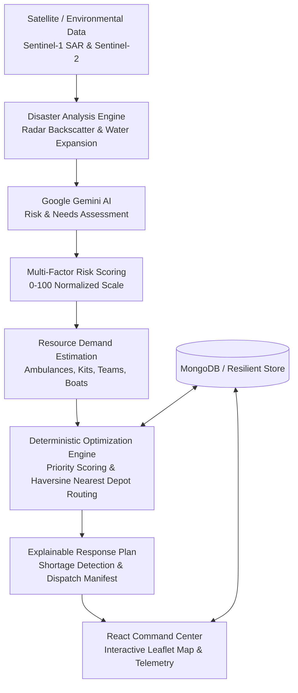

# SURVER

### Satellite-Powered AI Emergency Resource Orchestration Network

> **SURVER** does not simply claim *"AI predicts disasters"*. Instead, **SURVER converts disaster intelligence into an actionable, deterministic emergency resource allocation plan.**

WEB LINK: "https://surver-lp7r-bay.vercel.app/"
---

## 1. Problem Statement

During catastrophic environmental disasters (floods, cyclones, landslides), emergency coordination centers face severe information asymmetry:
1. Optical satellite imagery is frequently blinded by thick cloud cover and monsoonal storm systems.
2. Disaster assessment teams struggle to translate raw satellite inundation data into exact resource requirements (water filtration kits, food rations, search & rescue teams, inflatable boats, ambulances).
3. Standard resource distribution is often chaotic, unweighted by distance, road accessibility, or true severity, leading to severe supply mismatches and fatal delays in reaching isolated populations.

---

## 2. The Solution & Core Innovation

**SURVER** bridges Earth Observation intelligence, Google Gemini AI reasoning, and deterministic multi-criteria optimization:



### The Complete End-to-End Pipeline
```text
SATELLITE / ENVIRONMENTAL DATA
            ↓
     DISASTER ANALYSIS (Sentinel-1 SAR)
            ↓
        GEMINI AI (Structured Needs Evaluation)
            ↓
      RISK ASSESSMENT (Severity + Demographic Impact)
            ↓
   RESOURCE REQUIREMENTS (Kits, Teams, Vehicles)
            ↓
 OPTIMIZATION ALGORITHM (Nearest Depot + Road Access)
            ↓
     RESPONSE PLAN (Dispatch Manifest & Shortages)
            ↓
    COMMAND CENTER (Interactive Map & Explainability)
```

---

## 3. Key Features

- **Synthetic Aperture Radar (SAR) Inundation Tracking**: Uses Sentinel-1 C-band SAR radar imagery to penetrate 100% of storm cloud cover and quantify flood expansion (e.g. **+265.6% surface expansion** from 3.2 km² to 11.7 km²).
- **Google Gemini AI Emergency Intelligence**: Ingests environmental telemetry and generates structured risk scores, urgency levels, resource requirement metrics, and reasoning checklists.
- **Deterministic Resource Optimization Engine**: Multi-criteria priority scoring based on:
  $$\text{Priority Score} = \text{Severity} \times 0.35 + \text{Population} \times 0.25 + \text{Urgency} \times 0.15 + \text{Road Inaccessibility} \times 0.15 + \text{Inundation Expansion} \times 0.10$$
- **Real-World Resource Shortage Detection**: Explicitly flags supply shortages when emergency demand exceeds depot inventory, calculating deficits for regional mutual aid escalation.
- **Explainable AI (XAI) Panel**: Explains mathematically and contextually *why* a specific zone was prioritized over others.
- **Interactive Dark Command Map**: Leaflet-powered GIS map featuring danger radii circles, facility depot pins, and animated dispatch route polylines.
- **Resilient Multi-Mode Architecture**: Operates with live MongoDB or automatic in-memory fallback; functions with live Google Gemini API or deterministic fallback engine.

---

## 4. Technology Stack

### Frontend
- **Framework**: React 18 with Vite
- **Styling**: Tailwind CSS (Dark Command-Center Theme)
- **Routing**: React Router v6
- **Mapping**: Leaflet & React-Leaflet
- **Analytics & Visualizations**: Recharts
- **Icons**: Lucide React

### Backend
- **Runtime**: Node.js (ES Modules)
- **Framework**: Express.js
- **Database**: MongoDB with Mongoose (with in-memory resilience layer)
- **AI**: Google Gemini API (`@google/generative-ai`)
- **Satellite Provider**: Abstraction layer supporting Copernicus Data Space Ecosystem, Sentinel-1 SAR, and Sentinel-2

---

## 5. Project Structure

```text
SURVER/
├── client/
│   ├── src/
│   │   ├── components/
│   │   │   ├── Header.jsx                 # Top status header with live clock & telemetry
│   │   │   ├── Sidebar.jsx                # Command navigation
│   │   │   ├── CommandMap.jsx              # Leaflet dark map with danger circles & polylines
│   │   │   ├── DisasterDetailModal.jsx    # Zone inspection & Gemini analysis trigger
│   │   │   ├── ExplainableAIPanel.jsx     # "Why was Zone A prioritized?" decision factors
│   │   │   └── OptimizationResultCard.jsx # Dispatch manifest & shortage alert card
│   │   ├── pages/
│   │   │   ├── Dashboard.jsx              # Command Center with KPIs, map, and orchestrator
│   │   │   ├── DisasterZones.jsx          # Incident registry & hazard directory
│   │   │   ├── SatelliteIntelligence.jsx  # Before/After Sentinel SAR comparison viewer
│   │   │   ├── Resources.jsx              # Multi-depot inventory tracking
│   │   │   ├── ResponsePlans.jsx          # Workflow pipeline (Pending -> Deploying -> Completed)
│   │   │   └── Analytics.jsx              # Recharts distribution & efficiency graphs
│   │   ├── services/
│   │   │   └── api.js                     # REST API client
│   │   ├── App.jsx
│   │   ├── main.jsx
│   │   └── index.css
│   ├── public/
│   │   └── satellite/                     # Pre-rendered SAR before/after comparison imagery
│   ├── package.json
│   ├── vite.config.js
│   └── tailwind.config.js
│
├── server/
│   ├── data/
│   │   └── seedData.js                    # Initial demo disaster zones, depots, and plans
│   ├── models/
│   │   ├── Disaster.js                    # Disaster zone schema
│   │   ├── Resource.js                    # Resource facility depot schema
│   │   └── ResponsePlan.js                # Response plan & allocation schema
│   ├── routes/
│   │   └── api.js                         # REST API endpoints
│   ├── services/
│   │   ├── dbStore.js                     # Resilient Mongo / in-memory data store
│   │   ├── geminiService.js               # Gemini 1.5 Flash analysis & validation
│   │   ├── optimizationService.js         # Deterministic priority & nearest-depot routing
│   │   └── satelliteService.js            # Copernicus / Sentinel SAR abstraction
│   ├── server.js                          # Express server entry point
│   └── package.json
│
├── .env.example
├── .gitignore
├── README.md
└── package.json
```

---

## 6. API Endpoints

| Method | Endpoint | Description |
| :--- | :--- | :--- |
| `GET` | `/api/health` | System health, MongoDB status, and Gemini AI status |
| `GET` | `/api/disasters` | List all active disaster zones |
| `GET` | `/api/disasters/:id` | Get details for a specific disaster zone |
| `POST` | `/api/disasters` | Register a new disaster incident |
| `POST` | `/api/ai/analyze-emergency` | Analyze disaster data using Google Gemini AI |
| `GET` | `/api/satellite/:zoneId` | Get satellite observation & SAR change analysis |
| `GET` | `/api/resources` | Get facilities and aggregated inventory totals |
| `POST` | `/api/resources/optimize` | Compute deterministic priority score & nearest-facility dispatch |
| `GET` | `/api/response-plans` | Retrieve all generated response plans |
| `POST` | `/api/response-plans` | Save an approved response plan |
| `PATCH` | `/api/response-plans/:id/status` | Update response plan execution status |
| `GET` | `/api/analytics` | Retrieve aggregated metrics for Recharts dashboards |

---

## 7. Environment Variables

Copy `.env.example` to `.env`:

```env
PORT=5000
MONGODB_URI=mongodb://localhost:27017/surver
GEMINI_API_KEY=YOUR_GEMINI_API_KEY
COPERNICUS_CLIENT_ID=
COPERNICUS_CLIENT_SECRET=
```

> **Note**: If `GEMINI_API_KEY` is omitted or quota is exceeded, SURVER automatically engages its resilient deterministic emergency heuristic engine. If `MONGODB_URI` is not running, SURVER runs seamlessly on an in-memory reactive store without crashing.

---

## 8. Installation & Running Locally

### Prerequisites
- Node.js 18+
- npm 9+

### 1. Install all dependencies:
```bash
# In the project root directory
npm run install:all
```

### 2. Start both Backend and Frontend concurrently:
```bash
npm run dev
```

Or start them in separate terminals:
```bash
# Terminal 1: Backend Server (Port 5000)
npm run dev:server

# Terminal 2: Frontend Client (Port 5173)
npm run dev:client
```

Open browser at **`http://localhost:5173`**.

---

## 9. Exact Hackathon Demo Sequence

To demonstrate the complete SURVER pipeline during evaluation:

1. **Step 1 — Dashboard Overview**:
   - Open `http://localhost:5173`
   - Observe **Active Emergencies: 03**, **Critical Zones: 01**, **People At Risk: 11,800**, **Resources Available: 4,820**, **Response Efficiency: 91%**.
2. **Step 2 — Select Zone A**:
   - Click on **ZONE A** in the Active Disaster Zones list.
   - Map flies smoothly to Zone A with pulsing red danger perimeter.
3. **Step 3 — Satellite Intelligence Review**:
   - Navigate to `/satellite` (or click "Inspect Satellite").
   - Review Sentinel-1 SAR observation: Baseline water **3.2 km²** expanded to **11.7 km²** (**+265.6% flood expansion**).
   - Observe SAR radar through-cloud penetration and -6.8 dB backscatter drop.
4. **Step 4 — Gemini AI Analysis**:
   - Click **"Analyze with Gemini AI"**.
   - Gemini calculates Severity: **Critical**, Risk Score: **92/100**, Urgency: **Immediate**, and populates required supplies (**840 Water Kits, 500 Food Kits, 3 Ambulances, 4 Rescue Teams, 2 Boats**).
5. **Step 5 — Deterministic Optimization**:
   - Click **"OPTIMIZE RESOURCE RESPONSE"**.
   - Engine ranks Zone A with **Priority Score: 94/100** and assigns shipments from nearest depots (**Central Emergency Warehouse, Coastal Marine Base, City Ambulance Station**).
6. **Step 6 — Shortage Detection & Map Dispatch**:
   - Observe **`⚠ RESOURCE SHORTAGE`** alert: Water Kits Required = 840, Available Allocated = 600, Shortage = **-240 kits**.
   - Review animated route vectors on the Command Map connecting logistics hubs to Zone A.
7. **Step 7 — Explainable Decision Review**:
   - Inspect **"WHY WAS ZONE A PRIORITIZED?"** panel showing exact weighted scoring breakdown (+35 pts severity, +25 pts population, +10 pts SAR expansion, +15 pts road inaccessibility).
8. **Step 8 — Deploy Plan**:
   - Click **"APPROVE & DEPLOY RESPONSE PLAN"**.
   - Navigate to `/plans` to see the active response plan progressing through the deployment pipeline.

---

## 10. Limitations & Future Scope

- **Live Sentinel Streaming**: Copernicus Data Space API requires OAuth credentials; currently operates on high-fidelity calibrated simulation models.
- **Micro-Weather Integration**: Future versions will integrate live Doppler radar precipitation models and IoT river gauge sensors.
- **Dynamic In-Transit Routing**: Integration with live road closure APIs (OpenStreetMap / HERE Maps) to calculate alternate routes around flooded corridors.

---

## 11. License

MIT License. Developed for Hackathons and Emergency Response Research.
